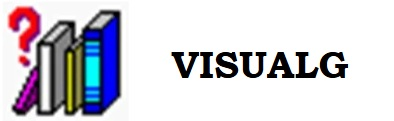

# DATAMASTER | Banco de Dados: API | 1ª Semestre - 2025

## 1. INTRODUÇÃO
O DataMaster surge como grupo de projeto integrador do curso de Banco de Dados da FATEC Prof. Jessen Vidal, unidade de São José dos Campos, SP.  Este grupo tem o propósito de consolidar os conhecimentos teóricos em lógica de programação, desenvolvimento de algoritmos e integração de sistemas por meio de uma metodologia prática. O projeto consiste em um programa capaz de executar cálculos e gerar sequências numéricas, utilizando pseudocódigos para validação inicial dos conceitos e, posteriormente, implementando um menu interativo que permita aos usuários navegar entre as funcionalidades desenvolvidas. Essa abordagem não apenas reforça os fundamentos da programação, mas também simula um ambiente real de desenvolvimento, onde a clareza lógica e a usabilidade são essenciais. Além de atender às exigências curriculares, o DataMaster demonstra a importância da articulação entre métodos teóricos e práticos, preparando os discentes para desafios profissionais que demandem soluções eficientes e sistemas bem estruturados, alinhando-se às demandas do mercado e à formação multidisciplinar proporcionada pela FATEC.

## 2. OBJETIVOS
*2.1 GERAL*: CONSTRUIR códigos de programação que identificam elementos de um conjunto de dados produzido por diferentes lógicas matemáticas.

*2.2 ESPECÍFICOS*: (1) RECONHECER as lógicas de matemáticas solicitadas; (2) DESCREVER o método de cada lógica matemática para construção dos conjuntos de elementos; (3) CONSTRUIR os conjuntos de elementos referentes a cada lógica matemática; (4) CRIAR os códigos no VisualG que atendam a demanda do cliente; (5) EXECUTAR os códigos no VisualG; (5) ANALISAR a execução dos códigos no VisualG; (6) AJUSTAR os códigos de acordo com cada necessidade; (6) ELABORAR a apresentação dos sprints.

## 3. METODOLOGIA
*3.1 PRODUCT BACKLOG*: demanda de todos os requisitos funcionais solicitados, conforme listados na tabela 1.

**Tabela 1.** Requisitos funcionais solicitados pelo cliente
| ID REQUISITOS |               REQUISITOS               | SPRINT | PRIORIDADE |
| ------------- | -------------------------------------- | ------ | ---------- |
|    RF001.0    | Sequência de Fibonacci                 |   1    |    Alta    |
|    RF002.0    | Sequência de Números Triangulares      |   1    |    Baixa   |
|    RF003.0    | Sequência de Quadrados Perfeitos       |   1    |    Média   |
|    RF004.0    | Sequência de Tribonacci                |   2    |    Alta    |
|    RF005.0    | Sequência Alternada                    |   2    |    Baixa   |
|    RF006.0    | Sequência de Números Primos            |   2    |    Média   |
|    RF007.0    | Sequência de Cubos                     |   3    |    Alta    |
|    RF008.0    | Sequência Geométrica                   |   3    |    Baixa   |
|    RF009.0    | Sequência Fatorial                     |   3    |    Média   |
|    RF010.0    | Menu Interativo                        | Todas  |    Alta    |

*3.2 FERRAMENTAS DIGITAIS:* recursos de tecnologia digital utilizados para desenvolvimento das tarefas previstas nos sprints.

**VisualG:** software desktop utilizado para a construção dos pseudocódigos e desenvolvimento das lógicas de programação.  
**Acesso em:**   

**Trello**: software digital utilizado como ferramenta para organização do product backlog, das sprints e da gestão de tarefas programadas.  
**Acesso em**:   

**Discord**: plataforma digital de comunicação utilizada para a integração social e funcional da equipe.  
**Acesso em**:   

**GitHub**: software digital utilizado como repositório de códigos de programação e controle de todas as versões construídas para o projeto. 
**Acesso em**:   

## 4. RESULTADOS
*4.1 PRODUCT BACKLOG SPRINT 1:* foram construídos os códigos de programação dos requisitos indicados na tabela 2.

**Tabela 2.** Tarefas realizadas dos requisitos previstos no sprint 1.
| ID REQUISITOS |              REQUISITOS            | PRIORIDADE |
| ------------- | ---------------------------------- | ---------- |
|    RF001.0    | Sequência de Fibonacci             |    Alta    |
|    RF002.0    | Sequência de Números Triangulares  |    Baixa   |
|    RF003.0    | Sequência de Quadrados Perfeitos   |    Média   |
|    RF010.0    | Menu Interativo                    |    Alta    |

> **Observação:** O requisito RF010.0 (Menu Interativo) está presente em todas as sprints para garantir a navegação e a integração das funcionalidades.
  
*4.2 INSTRUÇÕES DE USO*
1. **Clone o repositório:**
   ```bash
   git clone https://github.com/DataMaster-BD01/DataMaster.git
2. Copie e execute o código *main.alg* no VisualG.
   
## 5. EQUIPE TÉCNICA

| Foto                            | Nome               | Função          | GitHub                                                                                                                      | Linkedin                                                                                                                  |
| ------------------------------- | ------------------ | --------------- | --------------------------------------------------------------------------------------------------------------------------- | ------------------------------------------------------------------------------------------------------------------------- |
|  | Gabriel Farias     | Product Owner   | <a href="https://github.com/FariasTheProgrammer"></a>     | <a href="https://www.linkedin.com/in/gabrielrodfarias/"></a> |
|  | Guilherme Arruda   | Scrum Master    | <a href="https://github.com/guiggaaz"></a>     | <a href="linkedin.com/in/guilherme-almeida-de-arruda-368959332"></a> |
|      | Erick Faria        | Scrum Team      | <a href="https://github.com/ErickvFaria"></a> | <a href="https://www.linkedin.com/in/%C3%A9rick-vin%C3%ADcius-79193b253/"></a> |
|   | Benjamin Marques   | Scrum Team      | <a href="https://github.com/maarquueess"></a>     | <a href="https://www.linkedin.com/in/benjamin-do-prado-marques-benedito-48a4bb359?trk=contact-info"></a> |
|      | Paulo Cumbica      | Scrum Team      | <a href="https://github.com/cumbicaphs"></a>     | <a href="https://www.linkedin.com/in/paulo-h-s-cumbica-ba64711b7/"></a> |
|      | Pedro              | Scrum Team      | <a href="https://github.com/pedroquirino"></a>     | <a href="https://www.linkedin.com/in/pedro-quirino-909aa8270/"></a> |

