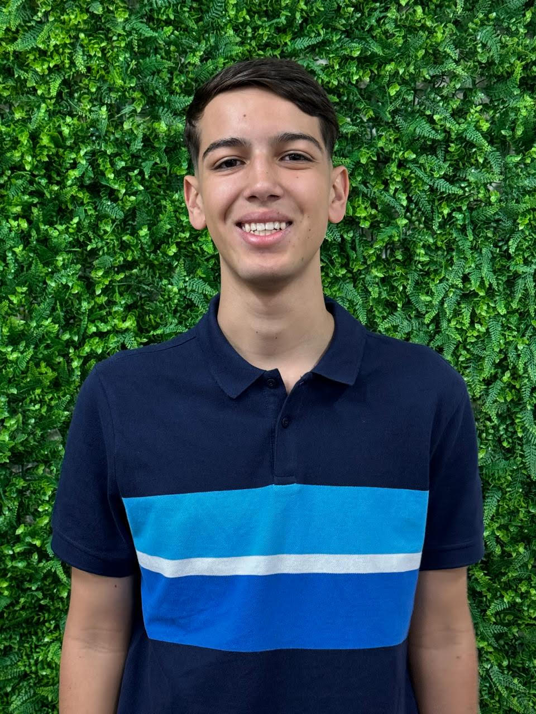

# Descrição:
API - BANCO DE DADOS | FATEC SJC (1º Semestre de 2025)

# Objetivo:

# MVP de Cada Sprint

## Sprint 1

# Product Backlog

## Requisitos Funcionais do projeto

| Nº do Requisito | Requisitos | Sprint | Prioridade |
| --- | --- | --- | --- |
| RF001.0 | Sequência de Fibonacci | 1 | Alta |
| RF002.0 | Números Triangulares | 1 | Baixa |
| RF003.0 | Sequência de Quadrado Perfeitos | 1 | Média |
| RF004.0 | Sequência de Tribonacci | 2 | Alta |
| RF005.0 | Sequência Alternada | 2 | Baixa |
| RF006.0 | Sequência de números primos | 2 | Média |
| RF007.0 | Sequência de Cubos | 3 | Alta |
| RF008.0 | Sequência Geométrica | 3 | Baixa |
| RF009.0 | Sequência Fatorial | 3 | Média |
| RF010.0 | Menu Interativo | Todas | Alta |

# Time

| Foto | Nome | Função | Github | Linkedin |
| :---------: | :---------: | :---------------------: | :-----------------: | :-------: |
|  | Gabriel Farias | Product Owner |  |  |
|  | Guilherme Arruda | Scrum Master |  |  |
|  | Erick Faria | Scrum Team |  |  |
|  | Benjamin Marques | Scrum Team |  |  |
|  | Paulo Cumbica |  Scrum Team  |  |  |
|  | Pedro |  Scrum Team  |  |  |
